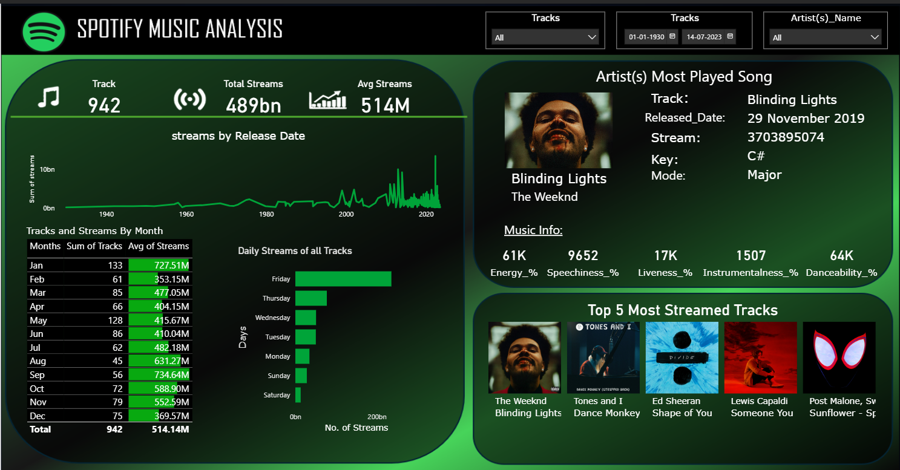

# 🎵 Spotify Music Analysis Dashboard

## 📌 Overview

This dashboard provides a **comprehensive analysis of Spotify music streaming data**. It helps visualize trends in total streams, track popularity, and artist performance over time. The dashboard is designed to give both high-level insights and detailed breakdowns of streaming behavior.

---

## 🚀 Features

### 🔢 Key Metrics

* **Total Tracks:** 942
* **Total Streams:** 489B
* **Average Streams per Track:** 514M

### 📊 Visual Insights

* **Streams by Release Date:** Line chart showing how streaming volumes evolved across decades.
* **Tracks and Streams by Month:** Breakdown of number of tracks released and their average streams month-wise.
* **Daily Streams Analysis:** Identifies which day of the week has the highest streaming activity.

### 🎶 Song & Artist Analysis

* **Most Played Song:**

  * Track: *Blinding Lights* – The Weeknd
  * Release Date: 29 November 2019
  * Streams: 3.7B+
  * Key: C# Major
  * Audio Features: Energy, Danceability, Speechiness, etc.

* **Top 5 Most Streamed Tracks:**

  1. Blinding Lights – The Weeknd
  2. Dance Monkey – Tones and I
  3. Shape of You – Ed Sheeran
  4. Someone You Loved – Lewis Capaldi
  5. Sunflower – Post Malone & Swae Lee

---

## 🛠️ Tools & Technologies

* **Power BI** – for building interactive visuals and dashboard design
* **Spotify Dataset** – streaming data used for analysis
* **Data Modeling** – relationships and aggregations for insights
---

## 🎯 Insights You Can Derive

* Which **songs and artists** dominate Spotify streaming charts
* Seasonal/monthly streaming patterns
* Daily streaming behaviors and trends
* Comparison of **historical vs. recent music popularity**

---

## 📷 Dashboard Preview

---

## 📌 Future Enhancements

* Add **genre-based breakdown** of streams
* Include **geographic distribution** of listeners
* Build a **predictive model** for forecasting future streams

---

✨ *This dashboard provides a data-driven look into the world of Spotify streaming and helps uncover patterns in how music is consumed globally.*
